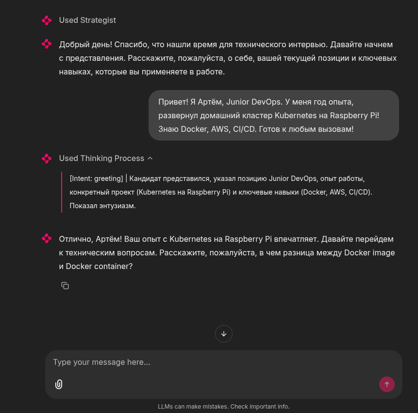

# Мультиагентная система симуляции технического интервью

## Краткое описание

Система представляет собой интеллектуального AI-интервьюера, построенного на базе мультиагентной архитектуры. Цель проекта — автоматизация процесса проведения технических собеседований с глубоким анализом ответов кандидата и формированием подробного фидбэка.

Стек технологий:

- Ядро: LangGraph (управление состоянием и логикой переходов).

- LLM Framework: LangChain.

- LLM модель: arcee-ai/trinity-large-preview:free

- Интерфейс: Chainlit (чат в реальном времени с отображением внутренних размышлений).

- Валидация: Pydantic (структурированный вывод данных).

## Интерфейс системы

## Quickstart

Для запуска у вас в системе должен быть установлен docker compose.

0. Перед запуском необходимо получить ваш бесплатный API-ключ на платформе [OpenRouter](https://openrouter.ai/)

1. Полученный ключ вставить в файл docker-compose.yml в текущей директории:

`OPENROUTER_API_KEY=ВАШ_КЛЮЧ`

2. Далее в терминале в главной директории проекта необходимо выполнить команду:

`docker compose up`

3. Если все выполнилось без ошибок, то интерфейс для взаимодействия с агентом можно будет найти по адресу: [0.0.0.0:8000](http://0.0.0.0:8000)

> Примечание! Так как ответ LLM по API занимает какое-то время, перед началом диалога необходимо дождаться приветсвенного слова от агента(около 30 секунд после запуска проекта) и только потом начинать диалог.

4. После завершения работы выполнить:

`docker compose down`

